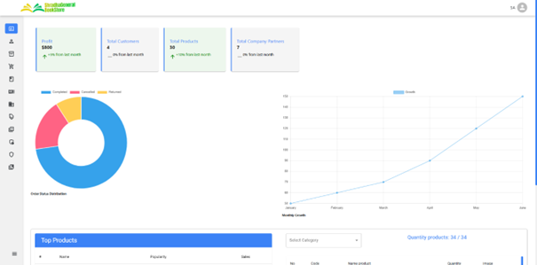
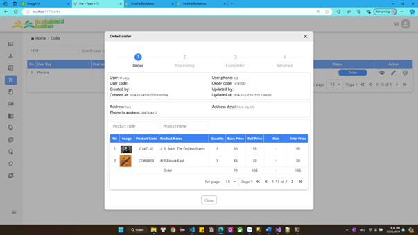
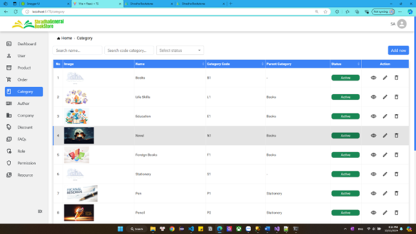
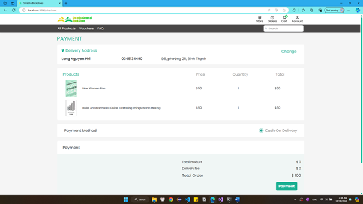

# ProjectSem3

## Mô tả dự án

ProjectSem3 là dự án Online Book Store (nhà sách trực tuyến) phục vụ đồ án học kỳ, được tổ chức theo mô hình monorepo gồm backend và 2 frontend.

Hệ thống tập trung vào các chức năng chính:
- Xác thực người dùng bằng JWT và refresh token.
- Quản lý dữ liệu nhà sách như người dùng, sách/sản phẩm, danh mục, đơn hàng, thanh toán, khuyến mãi.
- Cung cấp giao diện cho người dùng cuối và khu vực quản trị/legacy.

Monorepo cho dự án học kỳ gồm:
- Backend API: ASP.NET Core 8 + Entity Framework Core + JWT
- Frontend quản trị/legacy: React + TypeScript + Vite (`FrontEnd`)
- Frontend người dùng: React + TypeScript + Vite (`frontend-users`)

## Cấu trúc dự án

- `baseBackend`: Web API, kết nối SQL Server, xác thực JWT + refresh token
- `FrontEnd`: giao diện admin/user (router riêng)
- `frontend-users`: giao diện user mới (trang chủ, login, sản phẩm, cửa hàng...)

## Công nghệ chính

- Backend: `.NET 8`, `ASP.NET Core Web API`, `EF Core`, `SQL Server`, `Swagger`
- Auth: `JWT Bearer`, `BCrypt` hash password, `refresh token`
- Frontend: `React 18`, `TypeScript`, `Vite`, `Redux Toolkit`, `Axios`, `Sass`

## Yêu cầu môi trường

- .NET SDK 8.x
- Node.js 18+ (khuyến nghị 20+)
- SQL Server (hoặc SQL Server Express)
- npm

## Cấu hình nhanh

### 1) Backend (`baseBackend`)

File cấu hình chính:
- `baseBackend/appsettings.json`
- `baseBackend/Properties/launchSettings.json`

Mặc định backend chạy tại: `http://localhost:5047` (có Swagger tại `/swagger`).

Bạn cần cập nhật:
- `ConnectionStrings:ConnectDb` theo máy của bạn
- `Jwt:Key`, `Jwt:Issuer`, `Jwt:Audience`, `Jwt:PublicKey`

> Lưu ý bảo mật: không nên commit password DB/JWT secret thật vào git. Nên dùng Secret Manager hoặc biến môi trường.

### 2) Frontend admin/legacy (`FrontEnd`)

File env:
- `FrontEnd/.env`

Biến đang dùng:
- `VITE_REACT_APP_BACK_END_LINK="http://localhost:5047/api/"`

### 3) Frontend user (`frontend-users`)

File env:
- `frontend-users/.env`

Biến đang dùng:
- `VITE_API_BACKEND='http://localhost:5047/api/'`

## Cách chạy dự án

Mở 3 terminal riêng.

### Chạy backend

```bash
cd baseBackend
dotnet restore
dotnet run
```

Nếu cần cập nhật database bằng migration:

```bash
cd baseBackend
dotnet ef database update
```

### Chạy frontend `FrontEnd`

```bash
cd FrontEnd
npm install
npm run dev
```

Mac dinh Vite chay o `http://localhost:5173`.

Mặc định Vite chạy ở `http://localhost:5173`.

### Chạy frontend `frontend-users`

```bash
cd frontend-users
npm install
npm run dev
```

Nếu chạy đồng thời 2 frontend, hãy set cổng khác nhau để tránh trùng port (ví dụ một bên `5173`, một bên `5174`).

## CORS hiện tại

Backend đang allow:
- `http://localhost:5173`
- `http://localhost:3000`

Nếu frontend chạy cổng khác, cần sửa trong `baseBackend/Program.cs`.

## API chính hiện có

Base URL: `http://localhost:5047/api`

### Auth
- `POST /Auth/Login`: đăng nhập, trả `token` (và `refreshToken` nếu nhớ đăng nhập)
- `POST /Auth/RefreshToken`: cấp lại access token bằng refresh token
- `GET /Auth` (Authorize): kiểm tra token

### User
- `GET /User`: lấy danh sách user
- `POST /User`: tạo user mới (password được hash BCrypt)

Swagger: `http://localhost:5047/swagger`

## Route frontend (tham khảo nhanh)

### `frontend-users`
- `/home`
- `/login`
- `/store`
- `/all-products`

### `FrontEnd`
- `/` (user home)
- `/login`
- `/admin`
- `/admin/about`

## Lệnh hữu ích

### `FrontEnd`
- `npm run dev`
- `npm run build`
- `npm run lint`

### `frontend-users`
- `npm run dev`
- `npm run build`
- `npm run lint`
- `npm run lint:fix`
- `npm run prettier`
- `npm run prettier:fix`

## Ghi chú

- Một số controller trong backend đang để ở trạng thái comment/development (`ResourceController`, `ActionController`).
- Dự án đang có 2 frontend song song; nên thống nhất hướng sử dụng để tránh trùng lặp chức năng.

## Ảnh mô tả hệ thống

### Logo hệ thống


### Minh họa đăng nhập


### Dashboard quản trị


### Quản trị đơn hàng


### Quản lý danh mục



### Giao diện người dùng

